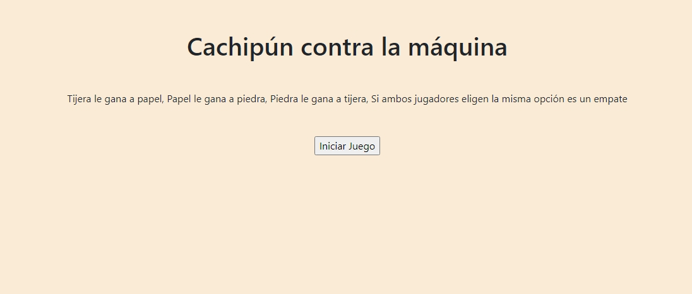

# Desafío Evaluado - Cachipún contra la máquina

La página muestra un título y una breve descripción del juego, así como un botón para iniciar el juego. El resultado del juego se mostrará después de cada ronda.

## Descripción

Cachipún es un juego clásico en el que dos jugadores (en este caso, tú y el computador) eligen de manera secreta una de las tres opciones: Piedra, Papel o Tijera. El ganador se determina según las siguientes reglas:

- **Tijera** le gana a **Papel**.
- **Papel** le gana a **Piedra**.
- **Piedra** le gana a **Tijera**.
- Si ambos jugadores eligen la misma opción, es un **empate**.

Este proyecto permite jugar Cachipún contra la máquina a través de una interfaz web simple.

## Vista Codificada

A continuación, se muestra la imagen del resultado codificado:

## Tecnologías Utilizadas

- HTML
- CSS
- JavaScript
- Bootstrap 5.3.2

## Estructura del Proyecto

El proyecto está compuesto por los siguientes archivos:

- `index.html`: Página principal del juego.
- `css/style.css`: Hoja de estilos para el diseño de la página.
- `js/script.js`: Script JavaScript que implementa la lógica del juego.

## Instrucciones de Uso

1. **Abrir la Página**: Abre el archivo `index.html` en tu navegador web.

2. **Iniciar el Juego**: Haz clic en el botón "Iniciar Juego" para comenzar a jugar.

3. **Elegir una Opción**: La máquina seleccionará una opción aleatoria y se comparará con la opción que elegiste.

4. **Resultado**: La página mostrará quién ganó el juego o si hubo un empate.

## Autor

Este proyecto fue desarrollado por **Valeria Torrealba**.