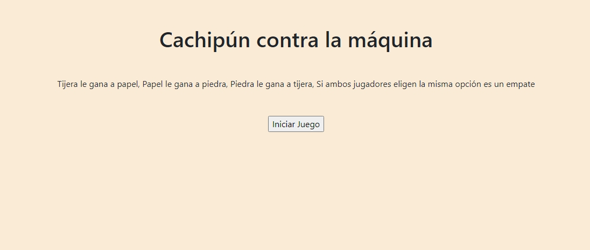

# Desafío Evaluado - Cachipún contra la máquina

El cachipún es un juego entre dos personas (en este caso, tú y el computador) donde cada una de ellas de manera independiente y secreta debe elegir una
de las opciones (piedra, papel y tijera) y compararla con la opción de la otra persona. Para determinar quien gana, se deben seguir las siguientes reglas:

  - Tijera le gana a papel
  - Papel le gana a piedra
  - Piedra le gana a tijera
  - Si ambos jugadores eligen la misma opción es un empate

